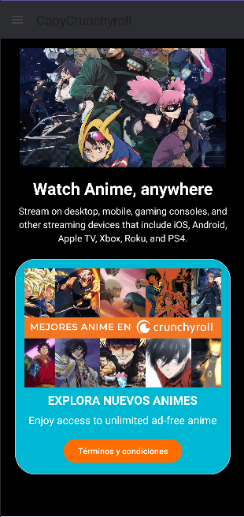
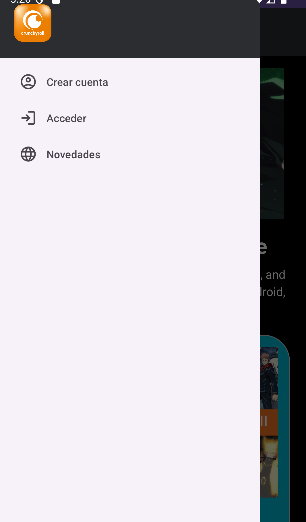
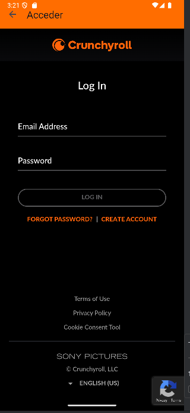
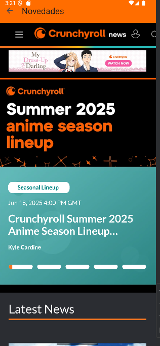

# 📱 CopyCrunchyroll

Una app Android inspirada en la interfaz de Crunchyroll, que permite navegar por diferentes secciones usando un menú lateral y visualizar contenido en una WebView.

## 🚀 Características

- 🎨 Interfaz con carrusel de imágenes
- 📋 Menú lateral de navegación (DrawerLayout)
- 🌐 WebView para acceder a páginas como:
    - Crear cuenta
    - Acceder
    - Novedades
- 💾 Persistencia de preferencias con SharedPreferences
- ☀️🌙 Soporte para modo claro/oscuro

## 🛠️ Tecnologías utilizadas

- Kotlin
- Android Jetpack
- ViewPager2
- DrawerLayout
- WebView
- Material Design 3

## 📷 Capturas de pantalla

1. **Ingresa pantalla pprincipal**
   
   
   
2. **Visualización del menú lateral**
   
   
   
3. **WebView en Login**: Se usa WebView para acceder.
   
   
   
4. **WebView en Novedades**: Puedes ver la web de Crunchyroll
 
   
   

## 🧪 Cómo probar la app

1. Clona el repo:
   ```bash
   git clone https://github.com/NiccoRoss/Sem08.git
